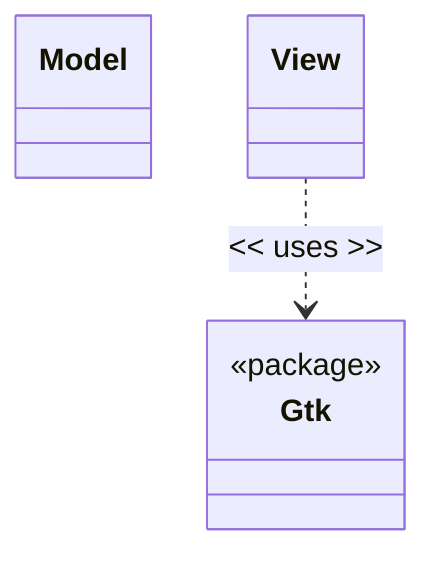

# Diseño software

flowchart TD
%% Nodes
    A("Medicamentos")
    B("Posologia")  
    C("Error")

A --> B & C
B --> B & C & A

<!-- ## Notas para el desarrollo de este documento
En este fichero debeis documentar el diseño software de la práctica.

> :warning: El diseño en un elemento "vivo". No olvideis actualizarlo
> a medida que cambia durante la realización de la práctica.

> :warning: Recordad que el diseño debe separar _vista_ y
> _estado/modelo_.
	 

